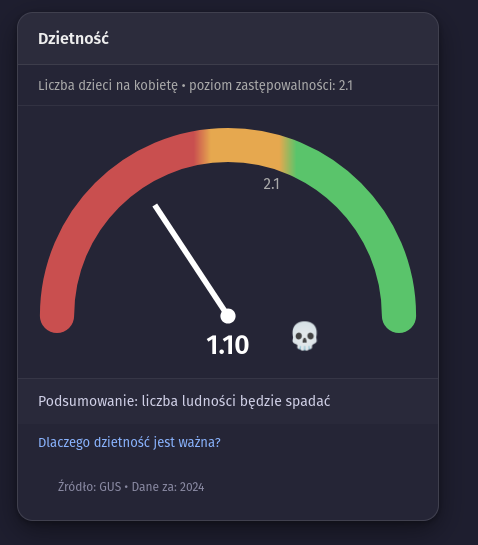
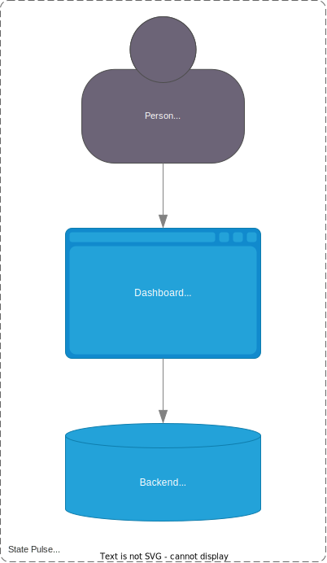

# StatePulse

StatePulse is a lightweight, open-source dashboard designed to monitor and visualize key state indicators such as demography, economy, and other public data. 





## Getting Started

To run StatePulse locally:

1. Clone this repository:
   ```bash
   git clone https://github.com/Kasztan404/StatePulse.git
   cd StatePulse
   ```

2. Start the server in the project directory:
   ```bash
   npx serve .
   ```

3. Open your browser and navigate to the provided local address (usually http://localhost:3000).

Alternatively, you can copy the project files to your own web server and serve them as static content.